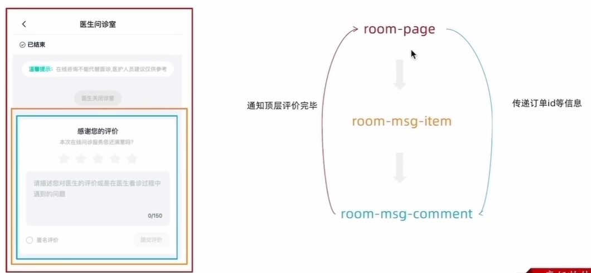

定义：

作用：顶层组件向任意的底层组件传递数据和方法，实现跨组件通信



跨层传递普通数据：

1.顶层组件通过provide函数提供数据

```
provide('key',顶层组件中数据)
```

2.底层组件通过inject函数获取数据

```
const message = inject('key')
```

跨层传递响应式数据：

顶层：

```
provide('app-key',ref对象)
```

底层：

```
provide('app-key')
```


