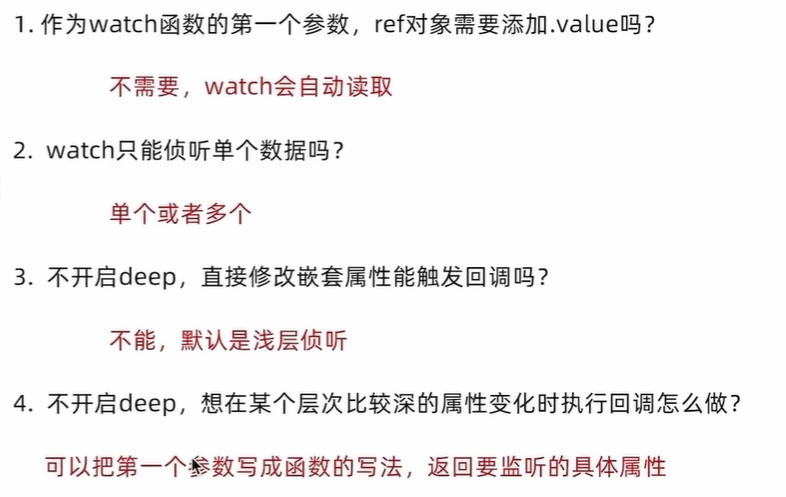

定义：侦听一个或者多个数据的变化，数据变化时执行回调函数

两个额外参数：1.immediate（立即执行） 2.deep（深度侦听）

`````javascript
import {ref,watch} from 'vue'
const count = ref(0)
watch(count,(newValue,oldValue)=>{
console.log('count发生了变化',newValue,oldValue)
})
`````

实际操作：

watch侦听单个数据源

```javascript
<script setup>

import { ref, watch } from 'vue'
const count = ref(0)

const setcount = () => {
  count.value++;
}
watch(count, (newVal,oldVal) => {	//ref对象不需要加.value
  console.log('count变化了',oldVal,newVal);
  
})
</script>

<template>
<div>
<button @click="setcount">+{{ count }}</button>
</div>
</template> 

```

watch侦听多个数据源

同时侦听多个响应式数据的变化，不管哪个数据变化都需要执行回调

```javascript
<script setup>
import { ref, watch } from 'vue'
const count = ref(0)
const name = ref("cp")
const setcount = () => {
  count.value++;
}
const changename = () => {
  name.value = "pc";
}
watch(
  [count, name],
  ([newcount, newname], [oldcount, oldname]) => {
    console.log("count或者name变化了",[newcount, newname], [oldcount, oldname]);
    
  }
)
</script>

<template>
<div><button @click="setcount">修改了count----{{ count }}</button></div>
<div><button @click="changename">修改了name----{{ name }}</button></div>
</template>
```

immediate

在侦听创建时立即触发回调，响应式数据变化之后继续执行回调

````js
<script setup>
import { ref, watch } from 'vue';

const count = ref(0)

const setcount = () => {
  count++
}
watch(count, () => {
  console.log("count变化了");
  
},{
  immediate:true
})
</script>

<template>
  {{count}}
<div><button @click="setcount">count---</button></div>
</template>
````

deep

默认机制：通过watch监听的ref对象默认时浅层侦听的，直接修改嵌套的对象属性不会触发回调执行，需要开启deep选项

````js
<script setup>
import { ref, watch } from 'vue';

const state = ref({count:0})

const setcount = () => {
  state.value.count++
}
watch(state, () => {
  console.log("count变化了");
  
}, {
  deep:true
})

</script>

<template>
  {{state.count}}
<div><button @click="setcount">count---</button></div>
</template>
````

精确侦听对象的某个属性

需求：在不开启deep的前提下，侦听age的变化，只有age变化时才执行回调

```
import { ref, watch } from 'vue';

const state = ref({
  name: "chaichai",
  age:18
})

const changename = () => {
  state.value.name = "chaichai-teacher"
}
const changeage = () => {
  state.value.age = 20
}
watch(
  () => state.value.age,
  ()=>{console.log("age被修改了");}
)

</script>

<template>
<div>{{state.name}}</div>
<div>{{ state.age }}</div>

<div><button @click="changename">修改name</button></div>
<div><button @click="changeage">修改age</button></div>

</template>
```

注意：deep占用内存，一般不用


