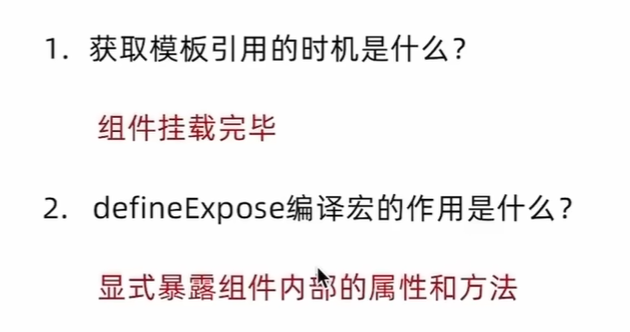

定义：通过ref获取获取真实的dom对象或者组件实例对象

```js
<script setup>
import {ref} from 'vue'
//1.调用ref函数得到ref对象
const h1Ref = ref(null)
</script>

<template>
<!-- 2.通过ref标识绑定ref对象 -->
<h1 ref="h2Ref">我是dom标签</h1>
</template>
```


操作

父组件：

```js
<script setup>
import testCom from './07-test-com.vue';
import { onMounted, ref } from 'vue';

// 赋值给变量 h2Ref -> 创建响应式对象
const h2Ref = ref(null)
const testComRef = ref(null)
//获取模板引用的前提条件是挂载完毕
onMounted(() => {
  console.log(h2Ref.value);
  console.log(testComRef.value);
  
  
})

</script>

<template>
<h1>这是父组件</h1>
<h2 ref="h2Ref">我是dom标签</h2>
<testCom ref="testComRef"></testCom>
</template>
```

子组件：
```js
<script setup>
import { ref } from 'vue';


const name = ref("test name")

const setname = () => {
    name.value = "test new name"
}
// 显示暴露组件内部的属性和方法（vue3里面原本是关闭的）
defineExpose({
    name,
    setname
})

</script>

<template>
    <h1>这是test页面</h1>
  
</template>
```

defineExpose()

默认情况下在<script setup>语法糖下组件内部的属性和方法是不开放给父组件访问的，可以通过defineExpose编译宏指定属性和方法允许访问

